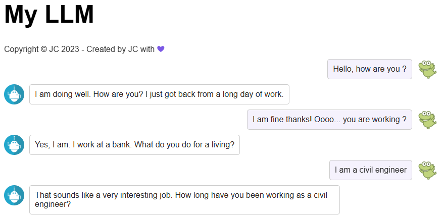

# LLM Application Chatbot


## Table of Contents

- [Description](#description)
- [What I improved/fixed](#what-i-improvedfixed)
- [How to run](#how-to-run)
- [Example](#example)
- [Future ideas](#future-ideas)
- [License](#license)
- [Acknowledgements](#acknowledgements)

# Description 

This project was originally created as part of IBM's *Building Generative AI-Powered Applications with Python* (Module 2) course.

## What I improved/fixed

- Fixed the chatbot backend to properly handle conversation context and tokenization, improving response relevance.  
- Added error handling and improved the frontend JavaScript to better manage loading states and API calls.  
- Refactored the Flask server to correctly encode the input and conversation history, avoiding tokenization issues.  
- Structured the code for clearer separation of frontend and backend logic.

These changes ensure the chatbot responds more coherently and the user experience is smoother.

## How to run
```bash
pip install -r requirements.txt
flask run
```

## Example

Here is a screenshot demonstrating a sample conversation with the chatbot:



The bot maintains context across multiple turns and provides coherent replies, reflecting the improvements made to the backend and frontend.

## Future ideas
- Try switching to DialoGPT
- Add a database for persistent chat history
- Use Docker to containerize

## License

This project includes code originally from IBM's *Building Generative AI-Powered Applications with Python* course, which does not specify a license.

This repository is licensed under the Apache License 2.0 for the code and modifications made by me.

Please refer to the original course for IBM's licensing terms.

## Acknowledgements

- IBM for the excellent course *Building Generative AI-Powered Applications with Python* which served as the foundation of this project.
- The Hugging Face team for providing the Transformers library and pretrained models.
